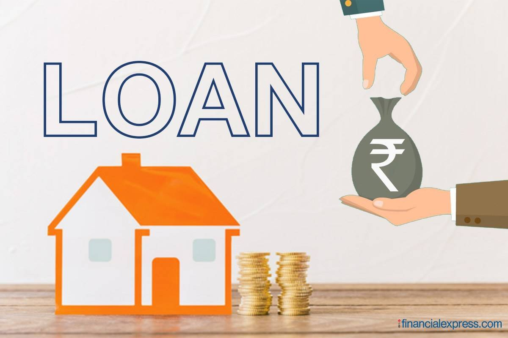

# Marketing Campaign for Banking Products

The project entitled **Marketing Campaign for Banking Products** has been built by myself as an **INTERNSHIP** in the guidance of [**Internship Studio**](https://internship.internshipstudio.com/) organization.

- Here I have attached the [problem statement](https://github.com/anshukcse/Bank-Loan-Model/blob/master/Marketing%20Campaign%20for%20Banking%20Products.pdf) which I have followed to build the best suited model.

- The [Dataset](https://github.com/anshukcse/Bank-Loan-Model/blob/master/Bank_Personal_Loan_Modelling.xlsx) has been also attached which has been taken from [**Kaggle**](https://www.kaggle.com/).

- I have used the [Colab Notebook](https://github.com/anshukcse/Bank-Loan-Model/blob/master/Bank_Loan_Model.ipynb) to build the model.

